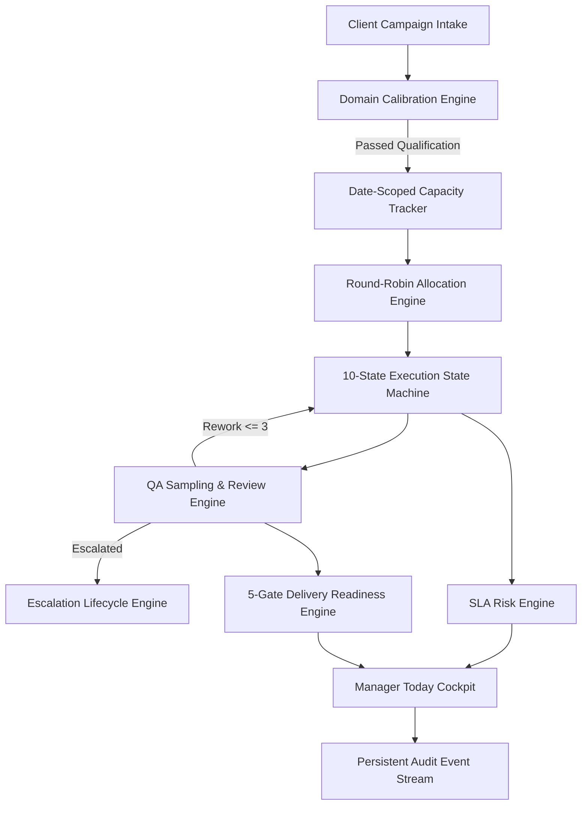

# OpsPilot — Human Data Campaign Operations Control System

[](https://github.com/kveigas/opspilot)
[](https://github.com/kveigas/opspilot)
[](https://github.com/kveigas/opspilot)
[](https://github.com/kveigas/opspilot)

OpsPilot is a production-grade, rules-based operational control system designed for **AI Data Operations Managers**, **Human Data Operations Leads**, and **AI Evaluation Program Managers**. It manages the end-to-end lifecycle of high-stakes human data annotation and evaluation campaigns — from intake and workforce calibration through deterministic allocation, 10-state task execution, QA review sampling, SLA risk monitoring, and delivery gate validation.

### 🌐 Live Public Deployment

- 🚀 **Live Public Demo**: [https://kveigas.github.io/opspilot/](https://kveigas.github.io/opspilot/)
- ⚙️ **Live API Base**: [https://opspilot-api.onrender.com](https://opspilot-api.onrender.com)
- 📖 **Interactive API Docs**: [https://opspilot-api.onrender.com/docs](https://opspilot-api.onrender.com/docs)

---

## 🎯 Core Operational Purpose

AI and RLHF (Reinforcement Learning from Human Feedback) data campaigns require rigorous operational governance. OpsPilot provides deterministic answers to the six fundamental questions of human data operations:

1. **Intake & Scope**: What volume of work is coming in, and what quality and throughput thresholds are contracted?
2. **Qualification**: Who in the workforce is qualified to perform work in specific domains or languages?
3. **Allocation**: How should unallocated task backlogs be distributed fairly and deterministically based on date-scoped capacity?
4. **Execution Control**: What is the real-time execution state of every task, and how are rework attempts enforced?
5. **Risk Isolation**: Where are SLA bottlenecks, open critical escalations, or quality failures developing?
6. **Delivery Verification**: Are we operationally ready to ship dataset deliverables to the client?

---

## 🏛️ System Architecture & Deterministic Engines

OpsPilot is built on a clean split between a **Python / FastAPI / SQLAlchemy** backend and a **React / TypeScript / Tailwind CSS** frontend. All operational logic is 100% rules-based, persistent, and verifiable.



### Key Functional Capabilities

- **Date-Scoped Capacity Enforcement**: Workers have explicit daily capacities (`max_daily_capacity`, `allocated_for_date`, `remaining_capacity_for_date`). Tasks are allocated strictly against operational dates without global ambiguity.
- **Conditional Qualification Engine**: Respects `campaign.calibration_required`. If calibration is required, worker qualification for the domain must be `PASSED`; otherwise, allocation is blocked.
- **Round-Robin Allocation Engine**: Allocates task backlogs across qualified workers balanced by remaining capacity ratio, existing allocated count, and worker ID sorting.
- **10-State Task Execution State Machine**: Validates transitions (`UNASSIGNED` → `ASSIGNED` → `IN_PROGRESS` → `SUBMITTED` → `IN_REVIEW` → `ACCEPTED` / `REWORK_REQUIRED` / `BLOCKED` / `ESCALATED` → `COMPLETED`).
- **QA Sampling & Review Engine**: Deterministically samples submitted tasks based on campaign `review_sampling_pct`. Unsampled tasks complete automatically; sampled tasks undergo immutable QA review with enforced maximum 3 rework attempts.
- **Multi-Factor SLA Risk Engine**: Calculates capacity ratios (`CR = available_capacity / required_daily_rate`) and evaluates SLA overrides (`CAMPAIGN_OVERDUE`, `ZERO_ELIGIBLE_CAPACITY`, `CRITICAL_ESCALATION_OPEN`, `REVIEW_BACKLOG_CRITICAL`, `BLOCKER_VOLUME_CRITICAL`).
- **5-Gate Mandatory Delivery Readiness Checklist**: Evaluates Volume Completeness (100%), QA Sampling Target, Quality Threshold, Zero Critical Escalations, and Zero Blocked Tasks.

---

## ⚡ Deterministic Public Demo Experience

OpsPilot includes a dedicated, zero-configuration **Public Demo Bootstrap Engine** designed to showcase full operational capabilities to recruiters and hiring leads in **2–3 minutes**.

### Demo Scenario Overview
- **Campaign**: *"Multilingual AI Response Evaluation"* (2,000 synthetic tasks, 16 workers).
- **Initial Unhealthy State**: Starts in **CRITICAL SLA** status due to an open critical guideline escalation (`Guidelines Ambiguity: Escalated Model Preference Standard`).
- **Data Provenance**: Explicitly tagged with metadata (`scenario_name`, `scenario_version`, `seed_identifier`, `synthetic: true`).

### 6-Step Recruiter Walkthrough Flow

1. **Load Demo Scenario**: Click `🚀 Load Public Demo Scenario` on the Today Cockpit.
2. **Inspect Today Cockpit**: View the initial `CRITICAL` SLA status banner and active critical escalation.
3. **Resolve Escalation**: Navigate to **QA & Escalations**, inspect the guideline issue, and click `Update Status` → `RESOLVED`.
4. **Check Calibration**: Navigate to **Calibration** to verify annotator qualifications and domain attempt scores.
5. **Execute Allocation**: Navigate to **Allocations** and click `⚡ Trigger Allocation Run` to distribute the unallocated backlog.
6. **Advance Workday & Verify Delivery**: Click `⚡ Advance Workday` in the header bar to simulate worker task completion and QA reviews, then inspect **Delivery Readiness** to view gate verification.

### Public Demo API Endpoints
- `POST /api/v1/demo/bootstrap`: Idempotently seeds or resets the synthetic demo scenario.
- `POST /api/v1/demo/advance-workday`: Executes real service state machine transitions across active demo tasks.
- `POST /api/v1/demo/reset`: Safely purges demo-owned entities and re-seeds baseline scenario.
- `GET /api/v1/demo/provenance`: Returns metadata confirming scenario version and synthetic status.

---

## 🛡️ Truthful Claims Audit & Scope Lock

To maintain complete professional integrity, OpsPilot explicitly declares its boundaries:

| Claim Category | Implementation Status | Technical Details |
| :--- | :--- | :--- |
| **Deterministic Core** | **VERIFIED IMPLEMENTED** | Rules-based state machine, capacity tracker, SLA engine, QA sampling, delivery gates. |
| **LLM / AI Logic** | **NOT INCLUDED BY DESIGN** | No artificial intelligence, LLM prompts, ML models, or RAG pipelines. |
| **Autonomous Agents** | **NOT INCLUDED BY DESIGN** | Operations are managed via explicit manager UI controls and rules. |
| **DataQual Integration** | **DECOUPLED** | OpsPilot operates as an independent campaign control application. |
| **Production Deployment** | **LOCAL DEMO ONLY** | Configured for local development, staging preview, and evaluation. |

---

## 💻 Technology Stack

### Backend
- **Python 3.13+** with **FastAPI** async web framework.
- **SQLAlchemy 2.0** ORM with **SQLite** database.
- **Pydantic V2** data validation and response schemas.
- **Pytest** with `pytest-cov` for automated backend unit/integration testing (92% coverage).
- **Ruff** & **Pyright** for strict linting and type checking.

### Frontend
- **React 18** with **TypeScript** & **Vite** build tooling.
- **Tailwind CSS** custom design system with WCAG 2.1 AA high-contrast dark theme.
- **Lucide React** icon suite.
- **Playwright** E2E test framework with `@axe-core/playwright` automated accessibility testing.

---

## 🚀 Quickstart & Local Verification Instructions

### 1. Prerequisites
- Python 3.13+ installed.
- Node.js 18+ and npm installed.

### 2. Backend Setup & Test Execution
```bash
# Navigate to project root
cd C:\Users\kveig\Documents\AI-Career-Tracker\OpsPilot

# Activate virtual environment (Windows)
.\.venv\Scripts\activate

# Run backend unit and integration test suite
pytest tests/backend/ -v --cov=app --cov-report=term-missing

# Run code quality checks
ruff check backend/app
pyright backend/app
```

### 3. Frontend Setup & Build Verification
```bash
# Navigate to frontend directory
cd frontend

# Install dependencies
npm install

# Run TypeScript type check and ESLint
npm run typecheck
npm run lint

# Build production bundle
npm run build

# Run Playwright E2E & Axe accessibility test suite
npx playwright test
```

### 4. Running Application Locally
```bash
# Terminal 1: Start FastAPI Backend
uvicorn backend.app.main:app --reload --port 8000

# Terminal 2: Start Vite Frontend Dev Server
cd frontend
npm run dev
```

Open browser at `http://localhost:5173` to experience OpsPilot!

---

## 📄 License & Provenance

Developed as part of the AI Career Portfolio project suite. All synthetic demo datasets and campaign scenarios are synthetic and designed exclusively for technical demonstration.
