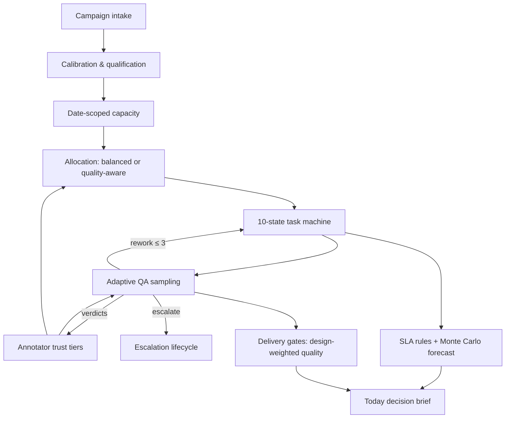

# OpsPilot — Human Data Campaign Operations

[](https://github.com/kveigas/opspilot)
[](#verification)
[](#verification)

OpsPilot is an operations cockpit for teams that run human-data programmes (annotation, RLHF preference ranking, AI evaluation). It covers the daily loop a campaign manager owns: intake, qualification, allocation, production, QA, escalations and delivery — with every decision explained and audited.

It is a **portfolio prototype running on synthetic data**. Authentication, tenant isolation, production concurrency and hosted backups are not implemented; do not use it for real client data.

- Live demo: https://kveigas.github.io/opspilot/ · API: https://opspilot-c5y3.onrender.com (`/docs` for OpenAPI)
- The public demo opens instantly. The API runs on a free tier that sleeps when idle, so the demo's deterministic starting state is computed at deploy time by the same backend code and shown while the API wakes (up to a minute); actions run as soon as it is ready.
- Reviews, fixes and their evidence are recorded in [docs/TECHNICAL_REASSESSMENT.md](docs/TECHNICAL_REASSESSMENT.md).

---

## What it does

| Step | What OpsPilot provides |
| --- | --- |
| **Today** | A decision brief: the next best action, SLA reasons in plain language, a completion forecast and delivered-quality outlook. |
| **Set up** | Campaigns (volume, quality target, QA policy), workforce skills and date-scoped capacity, calibration rounds that gate eligibility. |
| **Allocate** | Assigns work only to annotators with every required skill, a passed calibration and capacity on the campaign's operational date. *Quality-aware routing* sends urgent/high-priority work to annotators with the strongest QA record; each allocation records why. |
| **Execute** | A 10-state task machine that rejects invalid transitions; a per-task history view (state, sampling design, reviews, allocations, audit trail). |
| **QA review** | Keyboard-first review queue (J/K, A/R/B/E, H), escalation lifecycle with recorded decisions, rework limits (3 attempts, then escalation). |
| **Quality insights** | Annotator trust tiers with credible intervals, design-weighted quality estimates, review effort versus a flat policy, and a Monte Carlo completion forecast. |
| **Delivery** | Five mandatory gates, each with evidence and a "fix this" link. |

### Adaptive, trust-based QA

Reviewing the same share of everyone's work wastes effort on proven annotators and under-checks new or struggling ones. With the **Adaptive** policy:

1. Each annotator's first-pass acceptance has a Beta(1,1) prior updated with QA verdicts on the campaign.
2. The posterior probability of meeting the quality target sets a tier: **Trusted** (≥80%) spot-checked at 5%, **Standard** at the base rate, **Probation** (<8 verdicts) at 50%, **At risk** (<20%) reviewed in full.
3. Tasks are sampled independently at their tier's rate, and each task's inclusion probability is stored, so campaign quality is estimated with inverse-probability (Hájek) weights rather than being biased by the heavier review of weak annotators.
4. Delivered accuracy assumes reviewed tasks are corrected by rework and unreviewed tasks carry their annotator's estimated error rate.

**Evidence** ([scripts/benchmark_adaptive_qa.py](scripts/benchmark_adaptive_qa.py), [docs/evidence/](docs/evidence/ADAPTIVE_QA.md)): across 40 synthetic workforces (12 annotators, a quarter of them weak, 10 days, paired outcomes), adaptive sampling shipped **1.8%** undetected errors versus **3.5%** for flat sampling *with the same number of reviews* (better in 40/40 worlds). To match adaptive quality, flat sampling had to review **71%** of tasks versus **41%** — **43% fewer reviews**. These are synthetic worlds with assumed accuracy distributions; they are evidence about the policy, not a measurement of a real team.

### Operational safeguards

- **One transaction per business operation** — tasks, reviews, capacity and their audit records commit or roll back together.
- **Idempotency keys** — every mutating request carries an `Idempotency-Key`; the server replays the stored result for a repeated key, so the client can safely retry after timeouts.
- **Simulation clock** — the demo campaign runs on its own operational date, so fixed demo dates never "age" into a permanently overdue state. Real campaigns use the current date.
- **Timezone-correct timestamps** — the API always returns UTC offsets.
- **Non-destructive demo bootstrap** — seeding only happens after a successful, genuinely empty response; resets require confirmation.

---

## Demo walkthrough (about 3 minutes)

1. Open the app. An empty database seeds the synthetic campaign *Multilingual AI Response Evaluation* (2,000 tasks, 16 workers, 324 historical QA verdicts). The header shows the simulated day.
2. **Today** recommends the next action: resolve the critical guideline escalation. Record the decision.
3. **Allocate** with quality-aware routing and read why each annotator received each task.
4. Click **Advance workday**: production, adaptive QA sampling, synthetic verdicts, and the clock moves forward one working day.
5. **Quality insights**: see two annotators flagged *At risk* and fully reviewed, three *Trusted* and spot-checked, and the delivered-accuracy estimate.
6. **Delivery**: check the gates and their evidence; repeat workdays until the campaign is ready.

Press <kbd>?</kbd> anywhere for shortcuts and a glossary; <kbd>1</kbd>–<kbd>9</kbd> switch pages.

Synthetic ground truth: annotator accuracies are fixed per worker (0.84–0.99) and hidden from the QA engine, which must infer quality from verdicts.

---

## Architecture

Python 3.12 · FastAPI · SQLAlchemy 2 · Pydantic 2 · SQLite — React 18 · TypeScript · Vite · Tailwind CSS.


```mermaid
graph TD
    A[Campaign intake] --> B[Calibration & qualification]
    B --> C[Date-scoped capacity]
    C --> D[Allocation: balanced or quality-aware]
    D --> E[10-state task machine]
    E --> F[Adaptive QA sampling]
    F -->|verdicts| T[Annotator trust tiers]
    T --> F
    T --> D
    F -->|rework ≤ 3| E
    F -->|escalate| G[Escalation lifecycle]
    E --> H[SLA rules + Monte Carlo forecast]
    F --> I[Delivery gates: design-weighted quality]
    H --> J[Today decision brief]
    I --> J
```

Key modules: `services/quality_service.py` (trust, sampling, estimators), `services/forecast_service.py`, `services/allocation_service.py`, `services/transaction.py`, `idempotency.py`, `services/clock_service.py`.

---

## Running locally

Prerequisites: Python 3.12, Node.js 20+.

```bash
# Backend (from the repository root)
python -m venv .venv && . .venv/bin/activate      # Windows: .venv\Scripts\activate
pip install -r requirements-dev.txt
cd backend && DATABASE_PATH=/tmp/opspilot-dev.db uvicorn app.main:app --reload --port 8000
```

```bash
# Frontend (second terminal)
cd frontend
npm ci
npm run dev          # http://localhost:3000, proxies /api to 127.0.0.1:8000
```

Set `OPSPILOT_DEV_API_URL` to point the dev proxy at another port. Use a disposable `DATABASE_PATH` for experiments; opening an empty database seeds the demo.

<a id="verification"></a>
## Verification

```bash
pytest tests/backend/ --cov=app --cov-fail-under=90   # 74 tests, 95% coverage
ruff check backend/app && pyright backend/app
cd frontend && npm run typecheck && npm run lint && npm run test -- --run && npm run build
npx playwright test --workers=1                          # axe accessibility, operational flows, recruiter journey, responsive
python scripts/benchmark_adaptive_qa.py --worlds 40      # adaptive vs flat QA evidence
```

Playwright specs that touch the public deployment or the separate portfolio site only run with `OPSPILOT_E2E_EXTERNAL=1`. Automated axe checks are not a WCAG certification.

---

## Scope and honesty

| Area | Status |
| --- | --- |
| Deterministic operations core, audit trail | Implemented and tested |
| Adaptive QA, quality-aware routing, design-weighted estimates | Implemented; validated on synthetic simulations |
| Completion forecast | Monte Carlo planning aid with listed assumptions; not backtested |
| SLA status | Rules-based thresholds, not a predictive model |
| LLM / ML components | None |
| Authentication, multi-tenancy, hosted backups | Not implemented |

Licensed under the terms in [LICENSE](LICENSE). All demo data is synthetic.
