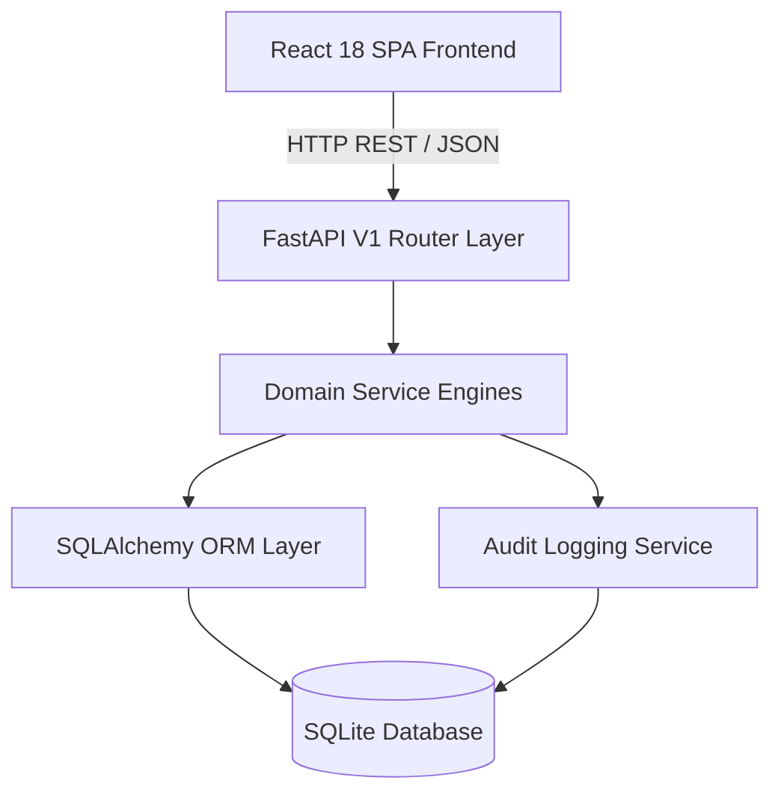

# OpsPilot v1.0.0-rc1 System Architecture Summary

OpsPilot is engineered with a clean, decoupled architecture separating a **React / TypeScript / Vite** Single-Page Application (SPA) from a **Python / FastAPI / SQLAlchemy** REST API service.

---

## 🏗️ High-Level Component Interaction

---

## 🛠️ Technology Stack Specifications

### Frontend Application Layer
- **Framework**: React 18.3+ with TypeScript 5.5+
- **Build Tooling**: Vite 5.4+
- **Styling & Icons**: Tailwind CSS 3.4+ with Lucide React icons
- **E2E & Accessibility Testing**: Playwright 1.46+ with `@axe-core/playwright`
- **Unit Testing**: Vitest 2.0+ with React Testing Library

### Backend API & Service Layer
- **Language Runtime**: Python 3.12 / 3.13
- **Web Framework**: FastAPI 0.115+ (ASGI via Uvicorn)
- **ORM & Database**: SQLAlchemy 2.0+ with SQLite Engine
- **Data Schemas**: Pydantic V2
- **Testing & Coverage**: Pytest 8.3+ with `pytest-cov` (92% test coverage)
- **Code Quality**: Ruff (linter/formatter) & Pyright (static type checker)

---

## ⚙️ Core Operational Engines

1. **Qualification Engine** (`qualification_helper.py`, `calibration_service.py`):
   - Evaluates campaign calibration requirement (`calibration_required`).
   - Validates worker attempt thresholds and pass scores against domain calibration rounds.

2. **Date-Scoped Capacity Tracker** (`capacity_service.py`):
   - Scopes daily worker capacity (`WorkerDailyCapacity`) by operational date (`capacity_date`).
   - Computes `remaining_capacity_for_date = max_daily_capacity - allocated_for_date`.

3. **Deterministic Allocation Engine** (`allocation_service.py`):
   - Filters candidate annotators by active status, availability, role, required skills, qualification, and capacity.
   - Sorts candidates deterministically by capacity ratio, allocated count, and worker ID.
   - Executes round-robin allocation to assign task backlogs to workers.

4. **Task State Machine Engine** (`transition_service.py`, `task_service.py`):
   - Enforces valid 10-state lifecycle graph (`UNASSIGNED`, `ASSIGNED`, `IN_PROGRESS`, `SUBMITTED`, `IN_REVIEW`, `ACCEPTED`, `REWORK_REQUIRED`, `BLOCKED`, `ESCALATED`, `COMPLETED`).
   - Enforces state transition guard conditions and audit logging.

5. **QA & Rework Engine** (`review_service.py`):
   - Evaluates QA sampling percentage (`review_sampling_pct`).
   - Automatically completes unsampled tasks; sends sampled tasks to `IN_REVIEW`.
   - Records immutable review decisions and enforces a maximum threshold of 3 rework attempts per task.

6. **Escalation Lifecycle Engine** (`escalation_service.py`):
   - Tracks operational escalations (`OPEN`, `INVESTIGATING`, `WAITING`, `RESOLVED`, `CLOSED`).
   - Manages task blocking status and resolution callbacks.

7. **SLA Risk Engine** (`sla_service.py`):
   - Calculates required daily rate (`remaining_tasks / working_days_remaining`) and capacity ratio ($CR$).
   - Evaluates SLA status (`ON_TRACK`, `AT_RISK`, `CRITICAL`) and applies hard risk overrides.

8. **Delivery Readiness Engine** (`delivery_service.py`):
   - Evaluates 5 mandatory delivery gates: Volume Completeness (100%), QA Sampling Target, Quality Threshold, Zero Open Critical Escalations, and Zero Blocked Tasks.

9. **Deterministic Demo Engine** (`demo_service.py`):
   - Idempotently seeds, resets, and advances 2,000 tasks and 16 workers across synthetic workday iterations.

---

## 🔄 Data Persistence & Flow Control

1. **Frontend State & API Sync**:
   - The React UI consumes REST endpoints via a typed `api` client (`client.ts`).
   - User actions trigger API requests that run backend service workflows and return updated persistent entities.

2. **Audit Provenance Stream**:
   - Every state transition, allocation run, QA decision, escalation update, and demo lifecycle event creates an immutable `AuditLog` entry.
