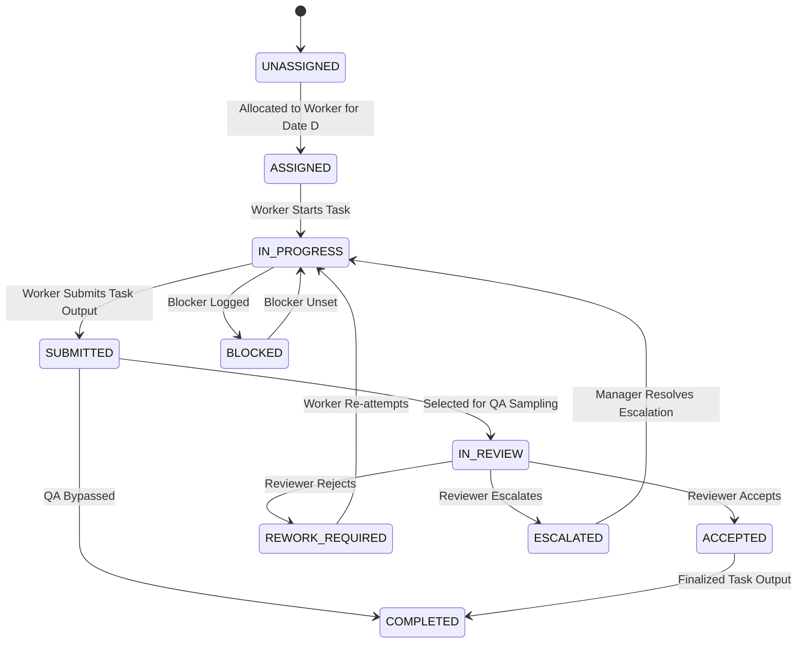

# OpsPilot — Business Rules & Deterministic Logic Engine (Updated with Final Corrections)

## 1. Campaign Intake Validation Rules (`BR-INT-001` to `BR-INT-006`)

- **BR-INT-001 (Date Sequence)**: `due_date` MUST be strictly greater than `start_date` (`due_date > start_date`).
- **BR-INT-002 (Volume Boundaries)**: `total_volume` MUST be an integer greater than 0 (`total_volume > 0`).
- **BR-INT-003 (Review Sampling Range)**: `review_sampling_pct` MUST be between 0.0% and 100.0% inclusive (`0.0 <= review_sampling_pct <= 100.0`).
- **BR-INT-004 (Quality Target Range)**: `target_quality_pct` MUST be between 50.0% and 100.0% inclusive (`50.0 <= target_quality_pct <= 100.0`).
- **BR-INT-005 (Target Throughput)**: `target_daily_throughput` MUST be greater than 0 (`target_daily_throughput > 0`).
- **BR-INT-006 (Worker Counts)**: `required_annotators >= 1` and `required_reviewers >= 0`.

---

## 2. Conditional Qualification Rules (`BR-QUAL-001` to `BR-QUAL-003`)

- **BR-QUAL-001 (Conditional Qualification Gate)**:
  For a given Campaign $C$ and Worker $W$:
  ```
  IF C.calibration_required == True:
      qualification_passed = (W has worker_qualifications record for C with status == PASSED)
  ELSE:
      qualification_passed = True
  ```
  *Key Behavior*: When `calibration_required == False`, qualification status does NOT independently block allocation.

- **BR-QUAL-002 (Calibration Evaluation)**:
  When calibration is conducted, worker status transitions to `PASSED` iff:
  $$\text{calibration\_score\_pct} \ge \text{pass\_threshold\_pct} \quad \text{AND} \quad \text{attempt\_number} \le \text{max\_allowed\_attempts}$$

- **BR-QUAL-003 (Attempt Limit Lockout)**:
  If a worker fails score threshold on their final allowed attempt (`attempt_number == max_allowed_attempts`), status transitions to `FAILED` and further attempts are locked.

---

## 3. Date-Scoped Capacity Logic (`BR-CAP-001` to `BR-CAP-004`)

- **BR-CAP-001 (Date-Scoped Metrics)**:
  Worker capacity is defined strictly by operational date $D$ (`YYYY-MM-DD`):
  - `max_daily_capacity(W, D)`: Maximum tasks worker $W$ can perform on date $D$.
  - `allocated_for_date(W, D)`: Total tasks allocated to worker $W$ across ALL active campaigns on date $D$.
  - `remaining_capacity_for_date(W, D)`:
    $$\text{remaining\_capacity\_for\_date}(W, D) = \text{max\_daily\_capacity}(W, D) - \text{allocated\_for\_date}(W, D)$$

- **BR-CAP-002 (Strict Non-Negative Capacity Rule)**:
  The allocation engine MUST NEVER allocate tasks to worker $W$ on date $D$ if:
  $$\text{tasks\_to\_allocate} > \text{remaining\_capacity\_for\_date}(W, D)$$

- **BR-CAP-003 (Cross-Campaign Competition Rule)**:
  If worker $W$ is assigned tasks for Campaign $A$ on date $D$, $W$'s `allocated_for_date(W, D)` is updated globally. The reduced `remaining_capacity_for_date(W, D)` immediately applies when evaluating $W$'s eligibility for Campaign $B$ on date $D$.

- **BR-CAP-004 (Default Daily Capacity Fallback)**:
  If no explicit `worker_daily_capacities` record exists for date $D$, `max_daily_capacity(W, D)` defaults to $W.\text{default\_max\_daily\_capacity}$ and `allocated_for_date(W, D)` starts at 0.

---

## 4. Work Allocation Engine Logic (`BR-ALL-001` to `BR-ALL-005`)

### Eligibility Rule (`BR-ALL-001`)
A worker $W$ is **eligible** to receive tasks for Campaign $C$ on date $D$ iff ALL of the following conditions evaluate to `TRUE`:
1. $W.\text{is\_active} == \text{True}$
2. $W.\text{availability} == \text{AVAILABLE}$
3. $W.\text{role} == \text{ANNOTATOR}$ (for annotation tasks) OR $W.\text{role} == \text{REVIEWER}$ (for review tasks)
4. $W$ possesses ALL required skill tags in $C.\text{required\_skills}$
5. **Conditional Qualification**: `(C.calibration_required == False) OR (W.qualification_status(C) == PASSED)`
6. **Date-Scoped Capacity**: `remaining_capacity_for_date(W, D) > 0`

### Allocation Ordering & Priority (`BR-ALL-002`)
Unallocated task batches are processed in order of:
1. Campaign `priority` rank: `URGENT` (1) > `HIGH` (2) > `MEDIUM` (3) > `LOW` (4)
2. Campaign `due_date` ascending (earliest deadline first)

### Tie-Breaking Rules (`BR-ALL-003`)
When multiple eligible workers have capacity on date $D$:
1. **Highest Remaining Capacity Ratio**: $\frac{\text{remaining\_capacity\_for\_date}(W, D)}{\text{max\_daily\_capacity}(W, D)}$ descending.
2. **Lowest Allocated Load for Date**: $\text{allocated\_for\_date}(W, D)$ ascending.
3. **Deterministic UUID Sort**: Worker UUID lexicographical ascending.

---

## 5. Task State Machine Transitions (`BR-ST-001`)



---

## 6. Complete SLA Risk Engine & Override Logic (`BR-SLA-001` to `BR-SLA-005`)

### Computed Metrics
1. **Required Daily Rate ($R_{\text{req}}$)**:
   $$R_{\text{req}} = \frac{\text{Remaining Uncompleted Tasks}}{\max(1, \text{Remaining Working Days})}$$
2. **Available Daily Capacity ($C_{\text{avail}}$)**:
   $$C_{\text{avail}} = \sum_{W \in \text{Eligible Workers for } C} \text{remaining\_capacity\_for\_date}(W, \text{current\_date})$$
3. **Capacity Ratio ($CR$)**:
   $$CR = \frac{C_{\text{avail}}}{R_{\text{req}}}$$
4. **Review Backlog Ratio ($\text{ratio}_{\text{review}}$)**:
   Let `submitted_review_eligible` = count of tasks currently awaiting or eligible for review.
   Let `unreviewed` = count of review-eligible tasks that have not received required review.
   ```
   IF submitted_review_eligible == 0:
       review_backlog_ratio = 0.0
   ELSE:
       review_backlog_ratio = unreviewed / submitted_review_eligible
   ```

### Deterministic Status & Reason Code Rules
- **ON_TRACK**:
  - $CR \ge 1.10$ AND zero overrides active.
- **AT_RISK**:
  - $0.85 \le CR < 1.10$ $\rightarrow$ Reason Code: `CAPACITY_BUFFER_LOW`
  - IF $CR < 1.00$, additionally emit: `INSUFFICIENT_CAPACITY`
- **CRITICAL**:
  - $CR < 0.85$ $\rightarrow$ Reason Code: `INSUFFICIENT_CAPACITY`

### Overrides (Mandatory Evaluated Sequence)
The SLA engine evaluates overrides in order:

1. **Overdue Campaign Override**:
   - `IF due_date < current_date AND remaining_tasks > 0`:
   - Status $\rightarrow$ `CRITICAL` | Reason Code: `CAMPAIGN_OVERDUE`
2. **Zero Eligible Capacity Override**:
   - `IF C_avail == 0 AND remaining_tasks > 0`:
   - Status $\rightarrow$ `CRITICAL` | Reason Code: `ZERO_ELIGIBLE_CAPACITY`
3. **Critical Escalation Override**:
   - `IF open_critical_escalations_count > 0`:
   - Status $\rightarrow$ `CRITICAL` | Reason Code: `CRITICAL_ESCALATION_OPEN`
4. **Review Backlog Boundary Override**:
   - `IF review_backlog_ratio > 0.50`:
   - Status $\rightarrow$ `CRITICAL` | Reason Code: `REVIEW_BACKLOG_CRITICAL`
   - `ELSE IF 0.25 < review_backlog_ratio <= 0.50`:
   - Status $\rightarrow$ `AT_RISK` | Reason Code: `REVIEW_BACKLOG_HIGH`
   - `ELSE (review_backlog_ratio <= 0.25)`: No review backlog override.
5. **Blocked Task Volume Override**:
   - `IF blocked_tasks_count > 15`:
   - Status $\rightarrow$ `CRITICAL` | Reason Code: `BLOCKER_VOLUME_CRITICAL`
   - `ELSE IF blocked_tasks_count > 5`:
   - Status $\rightarrow$ `AT_RISK` | Reason Code: `BLOCKER_VOLUME_HIGH`

### Exposed API Payload Structure
The `/api/v1/campaigns/{id}/sla` endpoint MUST expose:
```json
{
  "campaign_id": "c-multilingual-001",
  "status": "CRITICAL",
  "required_daily_rate": 243.0,
  "available_capacity": 180.0,
  "capacity_ratio": 0.74,
  "reason_codes": [
    "INSUFFICIENT_CAPACITY",
    "CRITICAL_ESCALATION_OPEN"
  ]
}
```

---

## 7. QA & Escalation Rules (`BR-QA-001` & `BR-ESC-001`)

### QA Reason Codes
- `LABEL_ERROR` | `GUIDELINE_AMBIGUITY` | `INCOMPLETE_WORK` | `FORMAT_ERROR` | `TOOLING_ISSUE` | `POLICY_QUESTION`

### Escalation Lifecycle
`OPEN` $\rightarrow$ `INVESTIGATING` $\rightarrow$ `WAITING` $\rightarrow$ `RESOLVED` $\rightarrow$ `CLOSED`. Resolving an escalation updates SLA risk and delivery gates immediately.

---

## 8. Delivery Readiness Engine Gates (`BR-DEL-001`)

| Gate | Requirement for `READY` | Blocking Reason Code if Failed |
|---|---|---|
| 1. Completion Gate | Completed Tasks == Total Volume | `VOLUME_INCOMPLETE` |
| 2. QA Sampling Gate | Reviewed Tasks >= (Completed Tasks * review_sampling_pct) | `REVIEW_REQUIREMENT_INCOMPLETE` |
| 3. Escalation Gate | Open Critical Escalations == 0 | `CRITICAL_ESCALATION_OPEN` |
| 4. Blocker Gate | Blocked Tasks == 0 | `BLOCKED_TASKS_EXIST` |
| 5. Quality Gate | Observed Quality % >= target_quality_pct | `QUALITY_TARGET_NOT_MET` |

- **READY**: All 5 gates PASS.
- **READY_WITH_WARNINGS**: Gates 1, 3, 4 PASS; minor non-critical QA sampling gap.
- **NOT_READY**: Any of Gates 1, 3, 4 FAIL.
