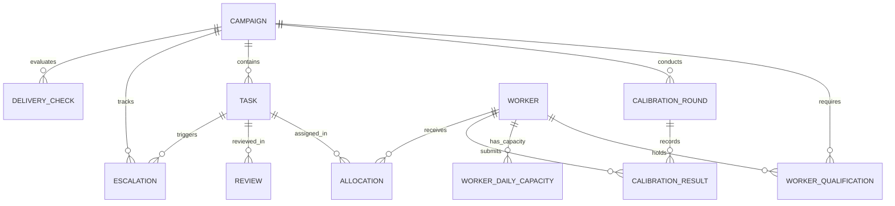

# OpsPilot — Relational Data Model Specification (Updated with Amendments)

## 1. Entity-Relationship Overview

---

## 2. Enums & Constants

### `CampaignStatus`
- `DRAFT`: Initial creation state.
- `ACTIVE`: Currently in execution.
- `PAUSED`: Temporarily halted by manager.
- `COMPLETED`: All tasks finished.
- `DELIVERED`: Successfully handed off to client.
- `ARCHIVED`: Closed campaign record.

### `CampaignPriority`
- `LOW` | `MEDIUM` | `HIGH` | `URGENT`

### `TaskType`
- `TEXT_ANNOTATION` | `IMAGE_BOUNDING_BOX` | `PREFERENCE_RANKING` | `RLHF_SAFETY_EVAL` | `AUDIO_TRANSCRIPTION` | `MULTIMODAL_QA`

### `WorkerRole`
- `ANNOTATOR` | `REVIEWER` | `LEAD`

### `WorkerAvailability`
- `AVAILABLE` | `BUSY` | `ON_LEAVE` | `INACTIVE`

### `CalibrationStatus`
- `NOT_STARTED` | `IN_PROGRESS` | `PASSED` | `FAILED` | `RETRY_REQUIRED`

### `TaskState`
- `UNASSIGNED` | `ASSIGNED` | `IN_PROGRESS` | `SUBMITTED` | `IN_REVIEW` | `ACCEPTED` | `REWORK_REQUIRED` | `BLOCKED` | `ESCALATED` | `COMPLETED`

### `SlaStatus`
- `ON_TRACK` | `AT_RISK` | `CRITICAL`

### `EscalationSeverity`
- `LOW` | `MEDIUM` | `HIGH` | `CRITICAL`

### `EscalationStatus`
- `OPEN` | `INVESTIGATING` | `WAITING` | `RESOLVED` | `CLOSED`

### `DeliveryStatus`
- `READY` | `READY_WITH_WARNINGS` | `NOT_READY`

---

## 3. Database Schemas

### Table: `campaigns`
| Column | Type | Constraints | Description |
|---|---|---|---|
| `id` | VARCHAR(36) | PRIMARY KEY | Unique campaign UUID |
| `name` | VARCHAR(120) | NOT NULL, UNIQUE | Campaign title |
| `client_name` | VARCHAR(120) | NOT NULL | Client or internal department |
| `task_type` | VARCHAR(40) | NOT NULL | Enum `TaskType` |
| `description` | TEXT | NULL | Detailed campaign scope |
| `total_volume` | INTEGER | NOT NULL, > 0 | Total task count |
| `target_quality_pct` | FLOAT | NOT NULL, 0-100 | Target quality threshold % |
| `review_sampling_pct` | FLOAT | NOT NULL, 0-100 | Target QA review sampling % |
| `target_daily_throughput`| INTEGER | NOT NULL, > 0 | Expected daily task completions |
| `start_date` | DATE | NOT NULL | Campaign start date |
| `due_date` | DATE | NOT NULL | Campaign completion deadline |
| `priority` | VARCHAR(20) | NOT NULL | Enum `CampaignPriority` |
| `status` | VARCHAR(20) | NOT NULL | Enum `CampaignStatus` |
| `calibration_required` | BOOLEAN | NOT NULL DEFAULT TRUE | Enforces qualification check if True |
| `required_annotators` | INTEGER | NOT NULL, >= 1 | Planned annotator staffing |
| `required_reviewers` | INTEGER | NOT NULL, >= 0 | Planned reviewer staffing |
| `created_at` | TIMESTAMP | NOT NULL | Creation timestamp |
| `updated_at` | TIMESTAMP | NOT NULL | Last update timestamp |

### Table: `workers`
| Column | Type | Constraints | Description |
|---|---|---|---|
| `id` | VARCHAR(36) | PRIMARY KEY | Unique worker UUID |
| `name` | VARCHAR(100) | NOT NULL | Full name |
| `email` | VARCHAR(120) | NOT NULL, UNIQUE | Worker email |
| `role` | VARCHAR(20) | NOT NULL | Enum `WorkerRole` |
| `timezone` | VARCHAR(40) | NOT NULL | Timezone string (e.g. UTC, PST) |
| `default_max_daily_capacity` | INTEGER | NOT NULL, > 0 | Default max daily task capacity |
| `availability` | VARCHAR(20) | NOT NULL | Enum `WorkerAvailability` |
| `is_active` | BOOLEAN | NOT NULL DEFAULT TRUE | Active status flag |
| `created_at` | TIMESTAMP | NOT NULL | Creation timestamp |

### Table: `worker_daily_capacities` (Date-Scoped Capacity)
| Column | Type | Constraints | Description |
|---|---|---|---|
| `id` | VARCHAR(36) | PRIMARY KEY | Unique record UUID |
| `worker_id` | VARCHAR(36) | FOREIGN KEY (workers.id) | Worker reference |
| `capacity_date` | DATE | NOT NULL | Specific operational date (YYYY-MM-DD) |
| `max_daily_capacity` | INTEGER | NOT NULL, > 0 | Max daily capacity for date |
| `allocated_for_date` | INTEGER | NOT NULL DEFAULT 0 | Total tasks allocated across ALL campaigns for date |

*Uniqueness Constraint*: `(worker_id, capacity_date)`

*Remaining Capacity Formula*:
$$\text{remaining\_capacity\_for\_date}(W, D) = \text{max\_daily\_capacity} - \text{allocated\_for\_date}$$

### Table: `worker_skills`
| Column | Type | Constraints | Description |
|---|---|---|---|
| `id` | VARCHAR(36) | PRIMARY KEY | Unique record UUID |
| `worker_id` | VARCHAR(36) | FOREIGN KEY (workers.id) | Worker reference |
| `skill_tag` | VARCHAR(50) | NOT NULL | Skill identifier (e.g. `medical`, `de`) |

*Uniqueness Constraint*: `(worker_id, skill_tag)`

### Table: `worker_qualifications`
| Column | Type | Constraints | Description |
|---|---|---|---|
| `id` | VARCHAR(36) | PRIMARY KEY | Unique record UUID |
| `worker_id` | VARCHAR(36) | FOREIGN KEY (workers.id) | Worker reference |
| `campaign_id` | VARCHAR(36) | FOREIGN KEY (campaigns.id)| Campaign reference |
| `status` | VARCHAR(30) | NOT NULL | Enum `CalibrationStatus` |
| `score` | FLOAT | NULL | Verified score % |
| `attempts_used` | INTEGER | NOT NULL DEFAULT 0 | Total calibration attempts |
| `qualified_at` | TIMESTAMP | NULL | Date passed qualification |

*Uniqueness Constraint*: `(worker_id, campaign_id)`

### Table: `calibration_rounds`
| Column | Type | Constraints | Description |
|---|---|---|---|
| `id` | VARCHAR(36) | PRIMARY KEY | Unique round UUID |
| `campaign_id` | VARCHAR(36) | FOREIGN KEY (campaigns.id)| Campaign reference |
| `domain_tag` | VARCHAR(50) | NOT NULL | Domain/skill evaluated |
| `total_test_tasks` | INTEGER | NOT NULL, > 0 | Number of test tasks |
| `pass_threshold_pct` | FLOAT | NOT NULL, 0-100 | Required passing score % |
| `max_allowed_attempts` | INTEGER | NOT NULL, >= 1 | Attempt limit |
| `status` | VARCHAR(20) | NOT NULL | Enum `CalibrationStatus` |
| `created_at` | TIMESTAMP | NOT NULL | Creation timestamp |

### Table: `calibration_results`
| Column | Type | Constraints | Description |
|---|---|---|---|
| `id` | VARCHAR(36) | PRIMARY KEY | Unique result UUID |
| `round_id` | VARCHAR(36) | FOREIGN KEY (calibration_rounds.id) | Calibration round |
| `worker_id` | VARCHAR(36) | FOREIGN KEY (workers.id) | Worker evaluated |
| `score_pct` | FLOAT | NOT NULL, 0-100 | Recorded score % |
| `passed` | BOOLEAN | NOT NULL | Pass/fail boolean |
| `attempt_number` | INTEGER | NOT NULL, >= 1 | Attempt sequence |
| `evaluated_at` | TIMESTAMP | NOT NULL | Timestamp of attempt |

### Table: `tasks`
| Column | Type | Constraints | Description |
|---|---|---|---|
| `id` | VARCHAR(36) | PRIMARY KEY | Unique task UUID |
| `campaign_id` | VARCHAR(36) | FOREIGN KEY (campaigns.id)| Campaign reference |
| `batch_id` | VARCHAR(36) | NOT NULL | Task batch grouping ID |
| `item_external_id` | VARCHAR(80) | NOT NULL | External dataset item ID |
| `state` | VARCHAR(20) | NOT NULL | Enum `TaskState` |
| `assigned_worker_id` | VARCHAR(36) | FOREIGN KEY (workers.id), NULL | Assigned annotator |
| `assigned_reviewer_id`| VARCHAR(36) | FOREIGN KEY (workers.id), NULL | Assigned reviewer |
| `requires_review` | BOOLEAN | NOT NULL DEFAULT FALSE | Selected for QA sampling |
| `payload_json` | TEXT | NOT NULL | Task input payload |
| `output_json` | TEXT | NULL | Annotator submitted output |
| `created_at` | TIMESTAMP | NOT NULL | Task creation timestamp |
| `updated_at` | TIMESTAMP | NOT NULL | Last update timestamp |

### Table: `allocations`
| Column | Type | Constraints | Description |
|---|---|---|---|
| `id` | VARCHAR(36) | PRIMARY KEY | Unique allocation UUID |
| `campaign_id` | VARCHAR(36) | FOREIGN KEY (campaigns.id)| Campaign reference |
| `task_id` | VARCHAR(36) | FOREIGN KEY (tasks.id) | Task reference |
| `worker_id` | VARCHAR(36) | FOREIGN KEY (workers.id) | Worker reference |
| `allocation_date` | DATE | NOT NULL | Date assigned for work |
| `allocated_by` | VARCHAR(40) | NOT NULL | `SYSTEM_AUTO` or `MANAGER_MANUAL` |
| `allocated_at` | TIMESTAMP | NOT NULL | Timestamp of allocation |

### Table: `reviews`
| Column | Type | Constraints | Description |
|---|---|---|---|
| `id` | VARCHAR(36) | PRIMARY KEY | Unique review UUID |
| `task_id` | VARCHAR(36) | FOREIGN KEY (tasks.id) | Task reference |
| `reviewer_id` | VARCHAR(36) | FOREIGN KEY (workers.id) | Reviewer reference |
| `verdict` | VARCHAR(20) | NOT NULL | `ACCEPTED`, `REWORK_REQUIRED`, `ESCALATED` |
| `qa_reason_code` | VARCHAR(40) | NULL | Enum QA Reason Code |
| `comments` | TEXT | NULL | Reviewer feedback |
| `reviewed_at` | TIMESTAMP | NOT NULL | Timestamp of review |

### Table: `escalations`
| Column | Type | Constraints | Description |
|---|---|---|---|
| `id` | VARCHAR(36) | PRIMARY KEY | Unique escalation UUID |
| `campaign_id` | VARCHAR(36) | FOREIGN KEY (campaigns.id)| Campaign reference |
| `task_id` | VARCHAR(36) | FOREIGN KEY (tasks.id), NULL | Linked task reference |
| `severity` | VARCHAR(20) | NOT NULL | Enum `EscalationSeverity` |
| `category` | VARCHAR(30) | NOT NULL | `GUIDELINE`, `QUALITY`, `TOOLING`, `CAPACITY`, `SLA` |
| `owner_name` | VARCHAR(100) | NOT NULL | Assigned manager/lead owner |
| `status` | VARCHAR(20) | NOT NULL | Enum `EscalationStatus` |
| `issue_description` | TEXT | NOT NULL | Detailed problem summary |
| `resolution_notes` | TEXT | NULL | Manager resolution summary |
| `created_at` | TIMESTAMP | NOT NULL | Escalation creation timestamp |
| `resolved_at` | TIMESTAMP | NULL | Timestamp of resolution |

### Table: `delivery_checks`
| Column | Type | Constraints | Description |
|---|---|---|---|
| `id` | VARCHAR(36) | PRIMARY KEY | Unique check UUID |
| `campaign_id` | VARCHAR(36) | FOREIGN KEY (campaigns.id)| Campaign reference |
| `status` | VARCHAR(20) | NOT NULL | Enum `DeliveryStatus` |
| `blocking_reasons_json`| TEXT | NOT NULL | JSON array of reason codes |
| `checked_at` | TIMESTAMP | NOT NULL | Timestamp of evaluation |

### Table: `audit_logs`
| Column | Type | Constraints | Description |
|---|---|---|---|
| `id` | VARCHAR(36) | PRIMARY KEY | Unique log UUID |
| `actor` | VARCHAR(80) | NOT NULL | User or system actor |
| `action` | VARCHAR(50) | NOT NULL | Action key (e.g. `WORKER_ALLOCATED`) |
| `entity_type` | VARCHAR(40) | NOT NULL | `CAMPAIGN`, `WORKER`, `TASK`, etc. |
| `entity_id` | VARCHAR(36) | NOT NULL | Target entity UUID |
| `summary` | TEXT | NOT NULL | Human-readable log description |
| `created_at` | TIMESTAMP | NOT NULL | Event timestamp |
