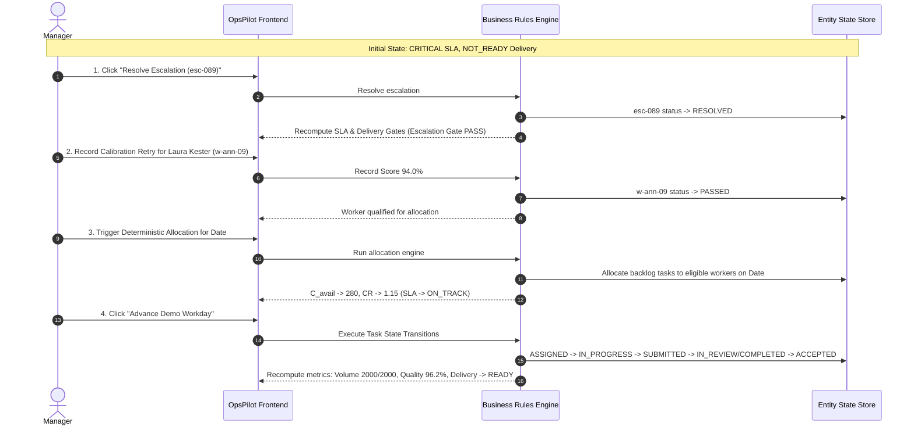

# OpsPilot — Deterministic Demo Campaign Scenario Specification (Updated with Amendments)

## 1. Scenario Overview

- **Campaign Name**: Multilingual AI Response Evaluation
- **Client**: Core LLM Alignment Group
- **Task Type**: `PREFERENCE_RANKING`
- **Total Volume**: 2,000 tasks
- **Start Date**: 2026-08-10 | **Due Date**: 2026-08-18 (8 calendar / 6 working days)
- **Target Throughput**: 250 tasks/day | **Required Daily Rate**: 243 tasks/day
- **Quality Target**: 95.0% | **Review Sampling Rate**: 20.0% (400 tasks required for review)
- **Required Skill Tags**: `de` (German language), `rlhf_safety`
- **Calibration Required**: `True`

---

## 2. Preset Workforce Roster (16 Workers) & Date Capacity

### Annotators (12 Workers) — Date: 2026-08-11
1. `w-ann-01`: Anna Weber | Skills: `de`, `rlhf_safety` | Date Capacity: 35/day | Status: `AVAILABLE` | Calib: `PASSED` (96%)
2. `w-ann-02`: Stefan Lang | Skills: `de`, `rlhf_safety` | Date Capacity: 35/day | Status: `AVAILABLE` | Calib: `PASSED` (94%)
3. `w-ann-03`: Maya Fischer | Skills: `de`, `rlhf_safety` | Date Capacity: 30/day | Status: `AVAILABLE` | Calib: `PASSED` (91%)
4. `w-ann-04`: Lukas Becker | Skills: `de`, `rlhf_safety` | Date Capacity: 30/day | Status: `AVAILABLE` | Calib: `FAILED` (78%, attempt 1/1)
5. `w-ann-05`: Elena Schmidt| Skills: `de`, `rlhf_safety` | Date Capacity: 35/day | Status: `BUSY` (Allocated 35/35 on Date)
6. `w-ann-06`: Jan Hoffmann | Skills: `de`, `rlhf_safety` | Date Capacity: 30/day | Status: `AVAILABLE` | Calib: `PASSED` (95%)
7. `w-ann-07`: Clara Wagner | Skills: `de` | Date Capacity: 30/day | Status: `AVAILABLE` | Calib: `NOT_STARTED` (Missing `rlhf_safety`)
8. `w-ann-08`: Tim Neumann  | Skills: `de`, `rlhf_safety` | Date Capacity: 30/day | Status: `AVAILABLE` | Calib: `PASSED` (92%)
9. `w-ann-09`: Laura Kester | Skills: `de`, `rlhf_safety` | Date Capacity: 25/day | Status: `AVAILABLE` | Calib: `RETRY_REQUIRED` (82%, attempt 1/2)
10. `w-ann-10`: Mark Richter | Skills: `de`, `rlhf_safety` | Date Capacity: 35/day | Status: `INACTIVE`
11. `w-ann-11`: Sophie Braun | Skills: `de`, `rlhf_safety` | Date Capacity: 30/day | Status: `AVAILABLE` | Calib: `PASSED` (97%)
12. `w-ann-12`: David Frank  | Skills: `de`, `rlhf_safety` | Date Capacity: 30/day | Status: `AVAILABLE` | Calib: `PASSED` (93%)

### Reviewers (3 Workers)
13. `w-rev-01`: Dr. Henrik Vogt | Role: `REVIEWER` | Skills: `de`, `rlhf_safety` | Date Capacity: 60/day | Status: `AVAILABLE`
14. `w-rev-02`: Julia Steiner   | Role: `REVIEWER` | Skills: `de`, `rlhf_safety` | Date Capacity: 50/day | Status: `AVAILABLE`
15. `w-rev-03`: Kevin Meyer     | Role: `REVIEWER` | Skills: `de`, `rlhf_safety` | Date Capacity: 50/day | Status: `ON_LEAVE`

### Lead (1 Worker)
16. `w-lead-01`: Marcus Vance   | Role: `LEAD`     | Skills: `de`, `rlhf_safety` | Date Capacity: 20/day | Status: `AVAILABLE`

---

## 3. Initial Campaign Bottleneck State (At Bootstrap)

- **Volume Completed**: 1,150 / 2,000 tasks (57.5%)
- **Remaining Backlog**: 850 tasks
- **Remaining Working Days**: 3.5 days
- **Required Daily Throughput ($R_{\text{req}}$)**: 243 tasks/day
- **Available Capacity ($C_{\text{avail}}$)**: 180 tasks/day
- **Capacity Ratio ($CR$)**: $0.74 < 0.85$
- **Initial SLA Status**: `CRITICAL` (Reason Codes: `INSUFFICIENT_CAPACITY`, `CRITICAL_ESCALATION_OPEN`)
- **Active Escalation**: `esc-089` | Severity: `CRITICAL` | Category: `GUIDELINE` (Owner: Marcus Vance)
- **Delivery Readiness**: `NOT_READY` (Reason Codes: `VOLUME_INCOMPLETE`, `CRITICAL_ESCALATION_OPEN`)

---

## 4. Valid State Machine Transition Model ("Advance Demo Workday")

> [!IMPORTANT]
> The demo MUST NOT directly overwrite campaign completion or delivery status. All state changes occur by transitioning task entities through valid machine states (`ASSIGNED` $\rightarrow$ `IN_PROGRESS` $\rightarrow$ `SUBMITTED` $\rightarrow$ `IN_REVIEW` $\rightarrow$ `ACCEPTED` / `REWORK_REQUIRED` $\rightarrow$ `COMPLETED`).

### Final State Re-evaluation
When all tasks reach `COMPLETED` via valid state machine transitions:
- Volume Gate: 2,000 / 2,000 (PASS)
- QA Sampling Gate: 410 / 400 reviewed (PASS)
- Escalations Gate: 0 open critical escalations (PASS)
- Blocker Gate: 0 blocked tasks (PASS)
- Quality Target Gate: 96.2% >= 95.0% (PASS)
- **Final Delivery Status**: `READY` (Emerged strictly from business rules).
