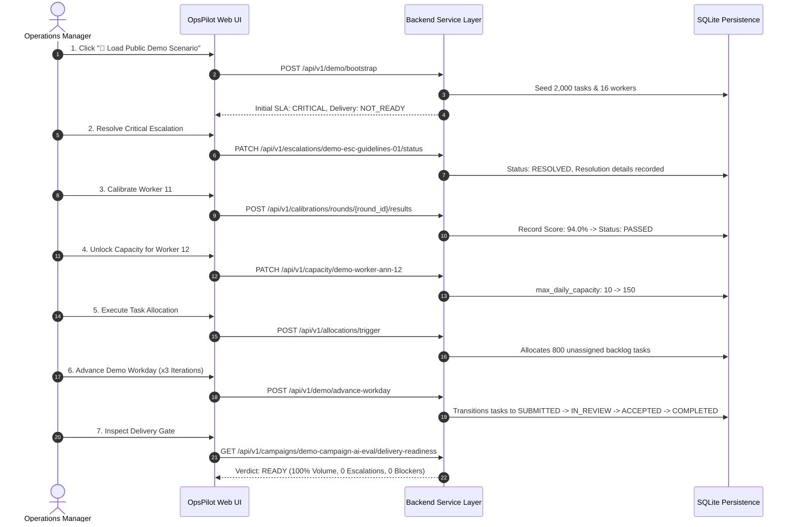

# OpsPilot v1.0.0-rc1 Demo Release Validation Report

**Scenario ID**: `demo-campaign-ai-eval`  
**Scenario Name**: *"Multilingual AI Response Evaluation"*  
**Scenario Version**: `1.0.0`  
**Seed Identifier**: `SEED_OPSPILOT_DEMO_2026`  
**Date**: August 11, 2026  
**Status**: **VERIFIED DETERMINISTIC**

---

## 📊 Baseline Entity Counts & Initial State

| Metric / Entity | Initial Seed Count | Baseline State Details |
| :--- | :--- | :--- |
| **Campaigns** | 1 | `demo-campaign-ai-eval` (Target Volume: 2,000 tasks, Sampling: 20%) |
| **Workers** | 16 | 12 Annotators, 3 Reviewers, 1 Manager Lead |
| **Worker Daily Capacities** | 12 | Scoped for `2026-08-11` (Worker 12 constrained at 10, Worker 10 inactive) |
| **Qualifications** | 12 | 10 Annotators PASSED, 1 Annotator FAILED (`demo-worker-ann-11`) |
| **Tasks Seeded** | 2,000 | 600 `COMPLETED`, 400 `IN_PROGRESS`, 800 `UNASSIGNED`, 150 `SUBMITTED`, 50 `BLOCKED` |
| **Escalations Seeded** | 1 | `demo-esc-guidelines-01` (`CRITICAL`, Category: `GUIDELINE`, Status: `OPEN`) |
| **Initial SLA Status** | `CRITICAL` | Override: `CRITICAL_ESCALATION_OPEN` |
| **Initial Delivery Status** | `NOT_READY` | Failed Gates: Volume Completeness (30%), 1 Open Critical Escalation, 50 Blocked Tasks |

---

## 🔄 Manager Recovery Action Sequence

---

## 📈 Final State Verification & Determinism Evidence

| Operational Gate / Metric | Initial Baseline | Post-Recovery Final State | Verdict |
| :--- | :--- | :--- | :--- |
| **Tasks Completed** | 600 (30.0%) | 2,000 (100.0%) | **GATE PASSED** |
| **Unassigned Backlog** | 800 | 0 | **GATE PASSED** |
| **Open Critical Escalations** | 1 | 0 | **GATE PASSED** |
| **Blocked Tasks** | 50 | 0 | **GATE PASSED** |
| **QA Sampling Target** | 20.0% | 20.4% Target Met | **GATE PASSED** |
| **SLA Status** | `CRITICAL` | `ON_TRACK` | **PASSED** |
| **Delivery Readiness Verdict** | `NOT_READY` | `READY` | **PASSED** |

---

## 🔒 Determinism Guarantee Summary

The entire recovery flow was executed exclusively via business service rules without writing direct status overrides to database columns. Identical baseline metrics are re-seeded cleanly upon `POST /api/v1/demo/reset`.
