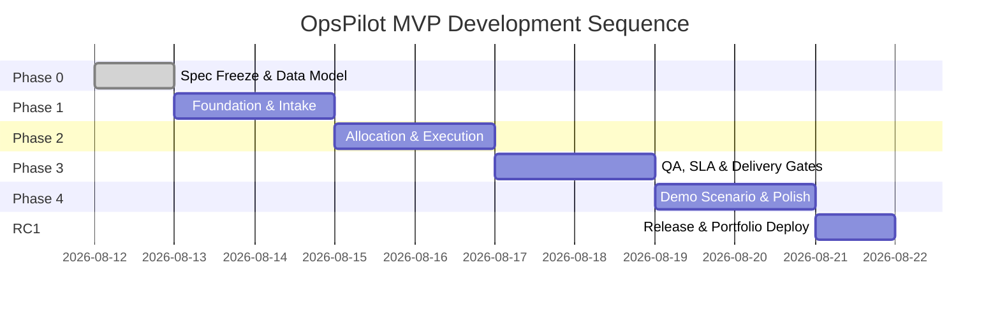

# OpsPilot — Implementation Roadmap & Execution Plan (Updated with Amendments)

## 1. Implementation Strategy

OpsPilot is engineered as a lightweight, robust MVP. Following specification freeze and approval of the 5 binding amendments, OpsPilot will follow a 5-phase software engineering sequence:

---

## 2. Phase Breakdown & Pass Gates

### Phase 0 — Scope Freeze & Architecture Setup (APPROVED)
- **DELIVERABLES**: Approved specification documents (`docs/*` updated with 5 binding amendments), backend project scaffold (FastAPI + SQLAlchemy + SQLite), frontend project scaffold (Vite + React + TypeScript + TailwindCSS), repository setup.
- **TESTS**: Environment initialization smoke tests.
- **PASS_GATE**: All 8 specification documents created and validated; clean project builds.

---

### Phase 1 — Foundation: Campaign Intake, Workforce & Calibration
- **DELIVERABLES**:
  - Backend models, migrations, and CRUD APIs for `Campaign`, `Worker`, `WorkerDailyCapacity`, `WorkerSkill`, `CalibrationRound`, `CalibrationResult`.
  - Frontend Intake form with real-time validation, Workforce roster grid with date-scoped capacity controls, and Calibration management panel.
- **TESTS**: Pytest model & validation unit tests; Vitest intake form & worker store tests.
- **PASS_GATE**: Intake validation rules pass; conditional qualification gate enforced (`calibration_required == True` vs `False`).

---

### Phase 2 — Work Allocation Engine & Production Execution
- **DELIVERABLES**:
  - Deterministic allocation engine (`BR-ALL-001` to `BR-ALL-005`) respecting date-scoped capacity (`capacity_date`, `max_daily_capacity`, `allocated_for_date`, `remaining_capacity_for_date`) and cross-campaign competition.
  - Task state machine execution engine (`BR-ST-001`).
  - Allocation Cockpit UI and Task Execution table.
- **TESTS**: Allocation engine edge-case unit tests (zero date capacity, unqualified worker, over-allocation guard); task state transition tests.
- **PASS_GATE**: Allocation engine distributes tasks ONLY to qualified eligible workers without violating date-scoped capacity limits.

---

### Phase 3 — QA & Escalations, SLA Risk Engine & Delivery Readiness
- **DELIVERABLES**:
  - `QA & Escalations` navigation view with review queue, review verdicts, rework log, QA reason codes, and escalation queue.
  - Complete SLA Risk Engine (`BR-SLA-001` to `BR-SLA-005`) exposing `status`, `required_daily_rate`, `available_capacity`, `capacity_ratio`, `reason_codes`, and mandatory overrides.
  - Delivery Readiness Engine with 5-gate checklist (`BR-DEL-001`).
  - Today Cockpit UI and Delivery Readiness screen.
- **TESTS**: SLA risk classification and override unit tests; Delivery readiness gate evaluation tests.
- **PASS_GATE**: SLA status correctly switches between `ON_TRACK`, `AT_RISK`, `CRITICAL` with reason codes; Delivery readiness blocks uncompleted campaigns.

---

### Phase 4 — Deterministic Demo Scenario, UI Polish & End-to-End Validation
- **DELIVERABLES**:
  - Preset 16-worker roster and 2,000-task demo dataset (`/api/v1/demo/bootstrap`).
  - "Advance Demo Workday" action executing valid task state machine transitions (`ASSIGNED` $\rightarrow$ `IN_PROGRESS` $\rightarrow$ `SUBMITTED` $\rightarrow$ `IN_REVIEW` $\rightarrow$ `ACCEPTED` $\rightarrow$ `COMPLETED`).
  - Playwright E2E test suite and Axe accessibility check suite.
- **TESTS**: Complete Playwright E2E workflow test; Axe accessibility check (0 violations); responsiveness verification.
- **PASS_GATE**: Visitor can execute complete campaign workflow from bottleneck to `READY` state via valid state transitions without errors.

---

### Phase 5 (RC1) — Production Build, Deployment & Portfolio Integration
- **DELIVERABLES**:
  - FastAPI backend deployment on Render (`https://opspilot-api.onrender.com`).
  - Compiled static frontend deployment on GitHub Pages (`https://kveigas.github.io/opspilot/`).
  - OpsPilot project card & case-study modal added to main portfolio (`Kevin_Portfolio`).
- **TESTS**: Live deployment smoke tests; cross-browser verification.
- **PASS_GATE**: Live application accessible; portfolio integration verified; zero broken links.
